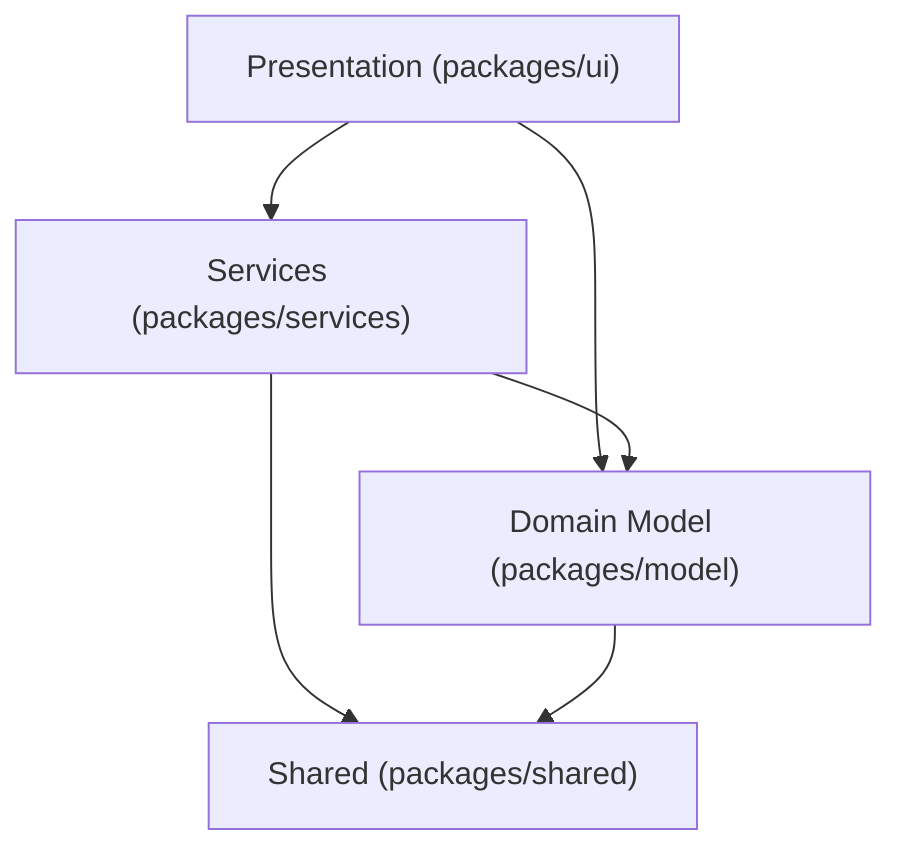

# SPA Layered Architecture Educational Example

A [monorepo](https://docs.npmjs.com/cli/using-npm/workspaces) demonstrating DDD-based layered architecture for a single-page application (SPA) with modern web technologies. There is no server-side component; all layers run in the browser.

## Contents

- [Architecture](#architecture)
- [Tech Stack](#tech-stack)
- [Developer Braindump](#developer-braindump)

## Architecture

**In a nutshell:** Domain objects are hydrated entities whose state is validated on creation. Repositories fetch and persist these entities. ViewModels access repositories exclusively, owning all UI state and serving as the binding switchboard to the view layer. This keeps each package focused on a single cohesive concern that is easy to reason about in isolation.

### Packages & Their Roles

- **[@todo/shared](packages/shared/src)** — Cross-cutting utilities (`delay`, `generateUuid`). No upstream dependencies.
- **[@todo/model](packages/model/src)** — Domain layer. `Todo` class with Zod-validated state. Depends on shared.
- **[@todo/services](packages/services/src)** — Data layer. `TodoRepository` with async CRUD operations. Depends on shared and model.
- **[@todo/ui](packages/ui/src)** — Presentation layer. React components, ViewModel, Zustand store. Depends on model and services.



Each layer may only depend on the layers below it. Shared is the foundation that any package may depend on.

```
    ┌──────────────────────────────────────────────────────┐
    │                    Presentation                      │
    │          React · ViewModel · Zustand Store           │
    │                                                      │
    │      ┌──────────────────────────────────────┐        │
    │      │              Services                │        │
    │      │     TodoRepository · Registry        │        │
    │      │                                      │        │
    │      │      ┌──────────────────────┐        │        │
    │      │      │    Domain Model      │        │        │
    │      │      │   Todo · Zod State   │        │        │
    │      │      └──────────────────────┘        │        │
    │      │                                      │        │
    │      └──────────────────────────────────────┘        │
    │                                                      │
    │   ┌──────────────────────────────────────────────┐   │
    │   │                   Shared                     │   │
    │   │           delay · generateUuid               │   │
    │   └──────────────────────────────────────────────┘   │
    │                                                      │
    └──────────────────────────────────────────────────────┘
              Dependencies point inward ───►
```

### Patterns

#### Domain Model (packages/model)

Each domain object is a class holding private state validated by a Zod schema. Constructors accept optional partial state with defaults. Static `parse()` and `defaultState()` methods handle creation. Getters/setters expose properties; identity fields are read-only.

State objects are plain serializable types (e.g. `ITodoState`) used to transfer data across layer boundaries: passed into constructors, returned from repositories, and serialized to/from JSON. Domain objects encapsulate these state objects, providing data protection through access control and adding behavior such as validation, computed properties, and mutation methods.

#### Repository and Services (packages/services)

Each aggregate root has a corresponding repository (e.g. `TodoRepository`) that exposes async CRUD methods and returns domain objects, not raw data. Repositories are the sole gateway to persistence; ViewModels never access storage directly. A `RepositoryRegistry` acts as a simple service locator, providing a single access point to all repository instances.

Services coordinate operations that span multiple repositories or involve cross-cutting concerns such as authorization, notifications, or transaction management. This example does not include any services yet, but they would live in this package alongside the repositories.

#### MVVM (packages/ui)

- **ViewModel:** Plain class (not React-specific) holding all UI state and domain model instances whose properties supply the data for view bindings. Delegates data operations to the repository. Accepts a `notify` callback to trigger reactivity.
- **Store:** Zustand store holds the ViewModel instance and a `version` counter. `notify` increments `version` to signal state changes.
- **View:** Thin React components that bind ViewModel properties to JSX and call ViewModel methods. One hook per ViewModel (`useTodoViewModel`), destructure `vm` from the store.

### Folder Structure

```
webapp-layered-architecture-educational-example/
├── packages/
│   ├── shared/                       — Cross-cutting utilities (@todo/shared)
│   │   ├── src/
│   │   │   ├── delay.ts              — Async delay helper
│   │   │   ├── generateUuid.ts       — UUID v4 generator
│   │   │   └── index.ts              — Public API barrel export
│   │   └── test/
│   │       ├── delay.test.ts
│   │       └── generateUuid.test.ts
│   │
│   ├── model/                        — Domain layer (@todo/model)
│   │   ├── src/
│   │   │   ├── shared/
│   │   │   │   └── EntityBase.ts     — Abstract base class for domain objects
│   │   │   ├── todo/
│   │   │   │   └── Todo.ts           — Todo entity with Zod-validated state
│   │   │   └── index.ts              — Public API barrel export
│   │   └── test/
│   │       └── todo/
│   │           └── Todo.test.ts
│   │
│   ├── services/                     — Data layer (@todo/services)
│   │   ├── src/
│   │   │   ├── shared/
│   │   │   │   └── RepositoryRegistry.ts — Service locator for repositories
│   │   │   ├── todo/
│   │   │   │   └── TodoRepository.ts     — Async CRUD operations for Todo
│   │   │   └── index.ts
│   │   └── test/
│   │       ├── shared/
│   │       │   └── RepositoryRegistry.test.ts
│   │       └── todo/
│   │           └── TodoRepository.test.ts
│   │
│   └── ui/                           — Presentation layer (@todo/ui)
│       ├── src/
│       │   ├── features/todo/
│       │   │   ├── store/
│       │   │   │   ├── TodoViewModel.ts    — UI state + repository delegation
│       │   │   │   └── useTodoViewModel.ts — Zustand hook
│       │   │   ├── AddTodo.tsx
│       │   │   ├── TodoContainer.tsx
│       │   │   ├── TodoItem.tsx
│       │   │   └── TodoList.tsx
│       │   ├── shared/components/
│       │   │   └── tailwind.ts       — Third-party component re-exports
│       │   ├── App.tsx
│       │   ├── app.css
│       │   └── main.tsx
│       ├── test/
│       │   └── features/todo/store/
│       │       ├── TodoViewModel.test.ts
│       │       └── useTodoViewModel.test.ts
│       ├── index.html
│       └── vite.config.ts
│
├── package.json                      — Root workspace config
└── tsconfig.json                     — Root TypeScript project references
```

## Tech Stack

| Layer | Technology |
|-------|-----------|
| Runtime | [Node.js ≥ 22.12.0](https://nodejs.org/) (tested on 25.1.0) |
| Build | [Vite 7](https://vite.dev/), [TypeScript 5.8](https://www.typescriptlang.org/) |
| Frontend | [React 18](https://react.dev/), [Zustand 5](https://zustand.docs.pmnd.rs/) |
| Styling | [Tailwind CSS 4](https://tailwindcss.com/), [Heroicons 2](https://heroicons.com/), [Headless UI 2](https://headlessui.com/) |
| Validation | [Zod 4](https://zod.dev/) |
| Testing | [Vitest 3](https://vitest.dev/) |
| Monorepo | [npm workspaces](https://docs.npmjs.com/cli/using-npm/workspaces) |

### Getting Started

```bash
npm install
npm run dev
```

### Scripts

```bash
npm run dev            # start dev server
npm run build          # typecheck + production build
npm run deps           # show package dependency tree
npm run test           # run all tests
npm run test:shared    # test shared utilities
npm run test:model     # test domain layer
npm run test:services  # test data layer
npm run test:ui        # test presentation layer
```

## Developer Braindump

### Note #1 — Why Separate Packages?

Splitting the codebase into `shared`, `model`, `services`, and `ui` packages is not about scale. It is about making dependency direction a compile-time constraint rather than a convention. Each package declares its dependencies explicitly in `package.json`, so the allowed relationships are machine-enforced: `model` can import from `shared` but never from `services` or `ui`; `services` can reach `shared` and `model` but never `ui`. A single-package codebase relies on developer discipline to maintain these boundaries; separate packages make violations impossible.

This structure also means each layer can be tested, built, and reasoned about in isolation. `npm run test:model` exercises the domain without touching React or a repository. A change to the UI layer cannot break the domain layer because the domain layer does not know the UI exists. The dependency graph reads bottom-up: `shared` → `model` → `services` → `ui`, and nothing points the other direction.

From a maintainability standpoint, strict package boundaries limit the blast radius of change. Replacing the in-memory repository with a real API client is a change scoped entirely to `services`; the domain model and UI are untouched. Swapping React for another framework only affects `ui`; the ViewModel, domain logic, and data access remain intact. When each package owns a single concern, contributors can orient quickly, changes stay local, and the codebase resists the slow drift toward entanglement that makes large applications difficult to maintain over time.

#### The Typical Single-Package Reality

Most web applications live in a single package. There is no structural enforcement of layer boundaries, so everything can import everything. In practice, this means concerns quietly merge inside components. A React component that calls `fetch`, transforms the response, validates input, manages loading and error states, and renders the result is simultaneously acting as a view, a service, and a partial domain model. Frameworks encourage this: hooks like `useEffect` for data fetching and `useState` for form state make it natural to colocate logic directly where it renders.

The result is that what the industry calls "views" or "components" are often doing the work of three or four architectural layers. This is not always wrong. For small applications or prototypes, the overhead of separation is not justified. But as a codebase grows, the mixture creates problems: business logic is duplicated across components, data access patterns are inconsistent, and testing a single rule requires mounting an entire UI tree.

This project exists to show the alternative. Components in the `ui` package are thin: they bind ViewModel properties to JSX and call ViewModel methods. They do not fetch data, validate input, or manage domain state. Those responsibilities live in their own packages with enforced boundaries. The difference is not just organizational; it changes what is testable without a browser, what survives a framework migration, and how quickly a new contributor can find where a behavior is implemented.

### Note #2 — PoEAA Usage

This codebase implements several patterns from Martin Fowler's [Patterns of Enterprise Application Architecture](https://martinfowler.com/eaaCatalog/) (PoEAA) and related sources.

| Pattern | Used In | Purpose | Reference |
|---------|---------|---------|-----------|
| Domain Model | [`EntityBase`](packages/model/src/shared/EntityBase.ts), [`Todo`](packages/model/src/todo/Todo.ts) | Rich objects that combine data and behavior, encapsulating business logic in the domain layer | [PoEAA](https://martinfowler.com/eaaCatalog/domainModel.html) |
| Layered Supertype | [`EntityBase`](packages/model/src/shared/EntityBase.ts) | Abstract base class that factors out common concerns (identity, versioning, dirty tracking) shared by all domain objects | [PoEAA](https://martinfowler.com/eaaCatalog/layeredSupertype.html) |
| Data Transfer Object | [`ITodoState`](packages/model/src/todo/Todo.ts), state schemas | Plain serializable structures that carry data across layer boundaries | [PoEAA](https://martinfowler.com/eaaCatalog/dataTransferObject.html) |
| Identity Field | [`EntityBase.uuid`](packages/model/src/shared/EntityBase.ts) | Unique identifier on each entity used for equality and persistence mapping | [PoEAA](https://martinfowler.com/eaaCatalog/identityField.html) |
| Repository | [`TodoRepository`](packages/services/src/todo/TodoRepository.ts) | Mediates between the domain and data mapping layers using a collection-like interface for accessing domain objects | [PoEAA](https://martinfowler.com/eaaCatalog/repository.html) |
| Service Locator | [`RepositoryRegistry`](packages/services/src/shared/RepositoryRegistry.ts) | Central registry providing access to repository instances without direct construction | [PoEAA](https://martinfowler.com/eaaCatalog/serviceLocator.html) |
| Model-View-ViewModel | [`TodoViewModel`](packages/ui/src/features/todo/store/TodoViewModel.ts), [Zustand store](packages/ui/src/features/todo/store/useTodoViewModel.ts), React components | Separates UI state and logic (ViewModel) from rendering (View), with the store providing change notification | [Microsoft](https://learn.microsoft.com/en-us/dotnet/architecture/maui/mvvm) |

### Note #3 — UI State Management and Rendering

All UI state lives on the `TodoViewModel`, a plain class, not a React construct. Zustand wraps this ViewModel in a store with a `version` counter that increments on every state change. Components use [selectors](https://zustand.docs.pmnd.rs/guides/prevent-rerenders-with-use-store) to cherry-pick the specific ViewModel properties they depend on, so only components whose selected slice has changed will re-render.

| Component | Selected Slice | Re-renders When |
|-----------|---------------|-----------------|
| [`TodoContainer`](packages/ui/src/features/todo/TodoContainer.tsx) | `vm.error` | Error state changes |
| [`TodoList`](packages/ui/src/features/todo/TodoList.tsx) | `vm, todos, isLoading, editingVersion` | List, loading, or editing state changes |
| [`AddTodo`](packages/ui/src/features/todo/AddTodo.tsx) | `vm` | Never (stable reference, same identity on every version bump) |
| [`TodoItem`](packages/ui/src/features/todo/TodoItem.tsx) | none (receives props) | Parent `TodoList` re-renders |

`TodoList` uses Zustand's [`useShallow`](https://zustand.docs.pmnd.rs/guides/prevent-rerenders-with-use-store#optimizing-with-useshallow) to do a shallow comparison of its multi-property selector, preventing re-renders when the selected values haven't changed.

**Accepted trade-offs:**

- When any item changes, `TodoList` re-renders all `TodoItem` components. Preventing this would require deep comparison of every Todo's properties per render cycle, a cost that exceeds just letting React re-render a short list of lightweight components.
- The `refresh()` method requires an explicit `notify` parameter (`true` or `false`) to force developers to consider whether a render cycle is needed. Callers that have their own `_notify()` immediately after pass `false` to avoid a redundant render pass.

### Note #4 — SPA Today, Full-Stack Tomorrow

This application is currently a SPA with no server-side component. The in-memory `TodoRepository` stands in for a real persistence layer. But the package structure is designed so that adding a server does not require rearchitecting the client. The `@todo/model` and `@todo/shared` packages have no browser or framework dependencies; they are pure TypeScript. A Node/Express/Fastify backend could depend on those same packages directly, sharing domain objects, validation schemas, and utility functions with the client. The `Todo` class, its Zod schema, and its broken-rules validation would run identically on both sides of the wire. The only change on the client would be swapping the in-memory repository for one that calls an API, a change scoped entirely to `@todo/services`.
